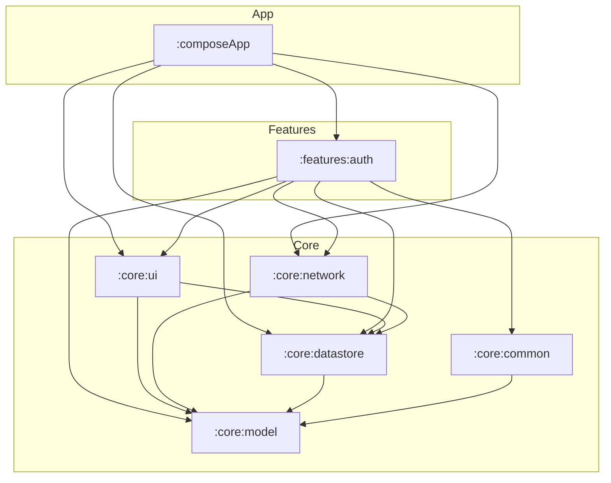

# RetailHub

## 1. Project Overview
RetailHub is a modern **Kotlin Multiplatform (KMP)** project designed for Android and iOS. Its main purpose is to demonstrate a highly scalable, modular architecture for retail applications, providing a shared business logic layer and a unified UI built with **Compose Multiplatform**. The project currently focuses on robust authentication, secure token management, native permission handling, and map integration.

---

## 2. Architecture
The project follows a **Modular, Feature-Based Architecture** with a strong emphasis on the **Separation of Concerns** and **SOLID** principles.

### Overall Approach
- **Modularization**: The codebase is split into physical Gradle modules based on functionality (features) and shared infrastructure (core).
- **MVI (Model-View-Intent)**: The presentation layer uses the MVI pattern to ensure a **Unidirectional Data Flow (UDF)**. ViewModels consume `Intents` from the UI and emit a single `UiState`.
- **Layered Features**: Each feature module (e.g., `:features:auth`) contains its own `data`, `domain`, and `presentation` layers, ensuring that business logic is isolated and highly testable.

### Dependency Flow
The dependencies flow from implementation details towards the core business logic:
- `composeApp` (App Entry) → `features` → `core:ui`, `core:network`, `core:datastore`, `core:common` → `core:model`.
- **Domain Independence**: Business logic in the `domain` package of each feature does not depend on external libraries like Ktor, DataStore, or Compose.
- **Controller-Delegate Pattern**: Used for platform-specific capabilities (Permissions, Camera, Maps) to keep ViewModels platform-agnostic while allowing UI-bound interactions.

### Mermaid Diagram


---

## 3. Module Structure

| Module | Responsibility | Depends on |
| :--- | :--- | :--- |
| `:composeApp` | Main entry point for Android and iOS. Orchestrates Koin initialization and global navigation. | `:features:auth`, `:core:network`, `:core:datastore`, `:core:ui` |
| `:features:auth` | Authentication feature logic, including Login screens, profile management, and address details. | `:core:ui`, `:core:network`, `:core:datastore`, `:core:model`, `:core:common` |
| `:core:ui` | Design system, common Compose components, Permission/Image Controller-Delegate system, and Form Engine. | `:core:model`, `:core:datastore` |
| `:core:datastore` | Persistent storage for user preferences and authentication tokens using Jetpack DataStore KMP. | `:core:model` |
| `:core:network` | Shared Ktor client configuration, including authenticated and public client variants. | `:core:model`, `:core:datastore` |
| `:core:common` | Low-level utilities such as Coroutine Dispatcher providers and Map logic. | `:core:model` |
| `:core:model` | Pure Kotlin library containing shared data types like `NetworkResult` and `AuthTokens`. | None |

---

## 4. Technology Stack

| Technology | Purpose |
| :--- | :--- |
| **Kotlin Multiplatform** | Sharing business logic and networking between Android and iOS. |
| **Compose Multiplatform** | Building a unified UI for both platforms using a single Kotlin codebase. |
| **DataStore KMP** | Type-safe, asynchronous persistent storage for both Android and iOS. |
| **Koin** | A pragmatic lightweight dependency injection framework. |
| **Ktor** | Asynchronous HTTP client for multiplatform networking. |
| **Coil 3** | Image loading library for Compose Multiplatform. |
| **Mapbox** | Used for static map generation via Static Maps API. |
| **BuildKonfig** | Multiplatform BuildConfig generation for managing API keys and secrets. |
| **Kotlin Serialization** | Type-safe JSON parsing for API requests and responses. |
| **Kotlin Coroutines** | Managing background tasks and asynchronous flows. |
| **Mokkery** | A Kotlin Multiplatform mocking library for testing. |
| **JaCoCo** | Library for measuring and reporting code coverage. |
| **Spotless** | Code formatting tool to enforce consistent style using KtLint. |
| **Detekt** | Static code analysis tool for Kotlin. |
| **Material 3** | Google's latest design system for consistent and modern UI. |

---

## 5. Dependency Injection
RetailHub uses **Koin** for dependency injection.

- **Initialization**: Koin is started via `initKoin(appDeclaration)` in the `:composeApp` module.
    - **Android**: Triggered in `RetailHubApplication.kt`, passing the `androidContext`.
    - **iOS**: Triggered in `iOSApp.swift` via the `KoinKt.initKoin` wrapper.
- **Platform Modules**: Uses the `expect val platformDataStoreModule` pattern to provide platform-specific implementations.
- **Controller-Delegate Lifecycle**: UI-bound controllers (Permissions, Image Picker) are injected as `factory` or `single` and bound to the UI lifecycle via a `Binder` composable on Android.
- **Qualifiers**: HttpClients are distinguished using names (`named(NetworkClientType.PUBLIC)` and `named(NetworkClientType.AUTHENTICATED)`).

---

## 6. Permission & Hardware Handling
The project implements a **Controller-Delegate** pattern to handle platform-specific hardware and system APIs (Camera, Gallery, Permissions) while keeping ViewModels platform-agnostic.

- **Permissions**: Managed via `PermissionController`. On Android, it uses `ActivityResultLauncher` bound via `InitializePermissionsAndPicker()`. On iOS, it uses native `AVFoundation` and `Photos` APIs.
- **Image Picking**: Managed via `ImagePickerController`, allowing seamless camera capture and gallery selection across platforms.

---

## 7. Networking
Networking is centralized in the `:core:network` module using **Ktor**.

- **Two-Client Strategy**: 
    - **Public Client**: Used for unauthenticated requests like Login or Token Refresh.
    - **Authenticated Client**: Automatically attaches Bearer tokens and handles 401 errors via a refresh mechanism.
- **Safe Requests**: A `safeRequest` extension function wraps network calls to catch exceptions and map them to a sealed `NetworkResult`.

---

## 8. UI
The UI is built entirely in **Compose Multiplatform** within the `:core:ui` and feature modules.

- **Form Engine**: A custom, reactive form system allows defining fields and validators in the ViewModel while rendering them automatically in the UI.
- **Resources**: Strings and colors are managed via Compose Multiplatform Resources (`Res`) for easy localization.
- **Maps**: Static map images are generated using Mapbox and displayed via Coil.

---

## 9. Testing Strategy
The project follows a comprehensive testing approach located in `commonTest`:

- **Mokkery**: Used to mock interfaces like `AuthenticationRepository` or `LoginUseCase`.
- **Ktor MockEngine**: Used in `AuthRemoteDataSourceImplTest` to simulate server responses.
- **Dispatcher Injection**: A `DispatcherProvider` is used to swap `Main` and `IO` dispatchers for `StandardTestDispatcher` during tests.

---

## 10. Build and Run

### Configuration
Before building the project, you must provide the necessary API keys:

1. Create a `secrets.properties` file in the project root.
2. Add your Mapbox access token:
   ```properties
   MAPBOX_ACCESS_TOKEN=your_mapbox_token_here
   ```

### Android
- **Build**: `./gradlew :androidApp:assembleDebug`
- **Run Tests**: `./gradlew :features:auth:testAndroidHostTest`

### iOS
- **Build/Run**: Use Xcode to open `iosApp/iosApp.xcodeproj`. The build is integrated with Gradle via the `embedAndSignAppleFrameworkForXcode` task.

### Common
- **Run All Tests**: `./gradlew allTests`
- **Format Code**: `./gradlew spotlessApply`
- **Check Formatting**: `./gradlew spotlessCheck`
- **Run Static Analysis**: `./gradlew detekt`

---

## 11. Project Status
- **Authentication**: Fully implemented MVI-based login flow with server-side error mapping.
- **Profile**: Native camera and gallery integration for profile pictures.
- **Hardware Integration**: Shared permission management and map visualization.
- **Infrastructure**: Robust multi-module Gradle setup with centralized networking and UI design system.
