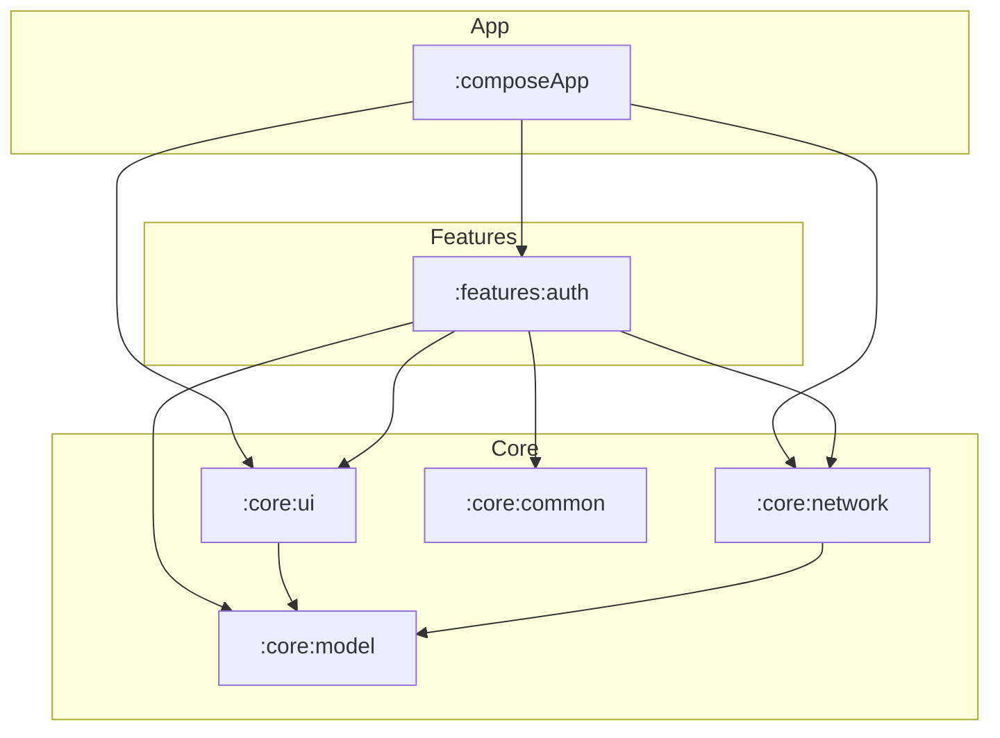

# RetailHub

## 1. Project Overview
RetailHub is a modern **Kotlin Multiplatform (KMP)** project designed for Android and iOS. Its main purpose is to demonstrate a highly scalable, modular architecture for retail applications, providing a shared business logic layer and a unified UI built with **Compose Multiplatform**. The project currently focuses on robust authentication and form management as its core foundation.

---

## 2. Architecture
The project follows a **Modular, Feature-Based Architecture** with a strong emphasis on the **Separation of Concerns** and **SOLID** principles.

### Overall Approach
- **Modularization**: The codebase is split into physical Gradle modules based on functionality (features) and shared infrastructure (core).
- **MVI (Model-View-Intent)**: The presentation layer uses the MVI pattern to ensure a **Unidirectional Data Flow (UDF)**. ViewModels consume `Intents` from the UI and emit a single `UiState`.
- **Layered Features**: Each feature module (e.g., `:features:auth`) contains its own `data`, `domain`, and `presentation` layers, ensuring that business logic is isolated and highly testable.

### Dependency Flow
The dependencies flow from implementation details towards the core business logic:
- `composeApp` (App Entry) → `features` → `core:ui` & `core:network` → `core:model`.
- **Domain Independence**: Business logic in the `domain` package of each feature does not depend on external libraries like Ktor or Compose.

### Mermaid Diagram


---

## 3. Module Structure

| Module | Responsibility | Depends on |
| :--- | :--- | :--- |
| `:composeApp` | Main entry point for Android and iOS. Orchestrates Koin initialization and global navigation. | `:features:auth`, `:core:network`, `:core:ui` |
| `:features:auth` | Authentication feature logic, including Login screens, validation, and user management. | `:core:ui`, `:core:network`, `:core:model`, `:core:common` |
| `:core:ui` | Design system, common Compose components, and the shared Form Engine. | `:core:model` |
| `:core:network` | Shared Ktor client configuration, logging, and networking extensions like `safeRequest`. | `:core:model` |
| `:core:model` | Pure Kotlin library containing shared data types like `NetworkResult` and `ApiErrorResponse`. | None |
| `:core:common` | Low-level utilities such as Coroutine Dispatcher providers. | None |

---

## 4. Technology Stack

| Technology | Purpose |
| :--- | :--- |
| **Kotlin Multiplatform** | Sharing business logic and networking between Android and iOS. |
| **Compose Multiplatform** | Building a unified UI for both platforms using a single Kotlin codebase. |
| **Koin** | A pragmatic lightweight dependency injection framework. |
| **Ktor** | Asynchronous HTTP client for multiplatform networking. |
| **Kotlin Serialization** | Type-safe JSON parsing for API requests and responses. |
| **Kotlin Coroutines** | Managing background tasks and asynchronous flows. |
| **Mokkery** | A Kotlin Multiplatform mocking library for testing. |
| **Material 3** | Google's latest design system for consistent and modern UI. |

---

## 5. Dependency Injection
RetailHub uses **Koin** for dependency injection.

- **Initialization**: Koin is started in `initKoin()` within the `:composeApp` module.
    - **Android**: Triggered in `MainApplication`.
    - **iOS**: Triggered in the `iOSApp.swift` init block via a Kotlin wrapper.
- **Module Definition**: Each module defines its own dependencies (e.g., `authModule`, `networkModule`).
- **ViewModel Provisioning**: ViewModels are provided using the `viewModel` DSL, allowing them to be lifecycle-aware in `commonMain`.

```kotlin
// Example feature module definition
val authModule = module {
    single<AuthenticationRepository> { AuthenticationRepositoryImpl(get()) }
    factory<LoginUseCase> { LoginUseCaseImpl(get()) }
    viewModel { LoginViewModel(get(), get()) }
}
```

---

## 6. Networking
Networking is centralized in the `:core:network` module using **Ktor**.

- **HttpClient**: Configured with `ContentNegotiation` (JSON) and `Logging`. It uses platform-specific engines (`OkHttp` for Android, `Darwin` for iOS).
- **Safe Requests**: A `safeRequest` extension function wraps network calls to catch exceptions and map them to a sealed `NetworkResult`.
- **Handling Errors**: The `handleResponse()` function maps HTTP status codes (401, 403, 500) and API-specific error bodies into type-safe failure states.
- **Data Sources**: Features use a `RemoteDataSource` interface to separate network implementation from repository logic.

---

## 7. UI
The UI is built entirely in **Compose Multiplatform** within the `:core:ui` and feature modules.

- **Form Engine**: A custom, reactive form system allows defining fields (`TextFormField`), validators (`Required`, `Email`), and state (`FormState`) in the ViewModel while rendering them automatically in the UI.
- **MVI Pattern**: The `LoginViewModel` maintains a `LoginUiState` exposed as a `StateFlow`.
- **Derived State**: Advanced optimizations using `derivedStateOf` are used in the UI to minimize recompositions for computed properties like `isEnabled`.
- **Resources**: Strings and colors are managed via Compose Multiplatform Resources for easy localization.

---

## 8. Testing Strategy
The project follows a comprehensive testing approach located in `commonTest`:

- **Mokkery**: Used to mock interfaces like `AuthenticationRepository` or `LoginUseCase`.
- **Ktor MockEngine**: Used in `AuthRemoteDataSourceImplTest` to simulate server responses and verify request parameters without actual network calls.
- **Unit Tests**: Coverage for Mappers, Validators, and UseCases.
- **ViewModel Tests**: Verify state transitions and side effects by sending `Intents`.
- **Compose UI Tests**: Use `runComposeUiTest` to verify that screens display correctly and react to user input.
- **Dispatcher Injection**: A `DispatcherProvider` is used to swap `Main` and `IO` dispatchers for `StandardTestDispatcher` during tests.

---

## 9. Build and Run

### Android
- **Build**: `./gradlew :androidApp:assembleDebug`
- **Run Tests**: `./gradlew :features:auth:testDebugUnitTest`

### iOS
- **Build/Run**: Use Xcode to open `iosApp/iosApp.xcodeproj`. The build is integrated with Gradle via the `embedAndSignAppleFrameworkForXcode` task.

### Common
- **Run All Tests**: `./gradlew test`

---

## 10. Development Guidelines
- **Adding Features**: Create a new package under `features/` following the `data/domain/presentation` structure.
- **Shared Models**: Data classes used across multiple modules must live in `:core:model`.
- **MVI Contract**: Every new screen should define a `Contract` interface containing `State`, `Intent`, and `Effect`.
- **Dependency Flow**: Feature modules should never depend on other feature modules. They should only interact via shared core modules or deep-linking logic in the app module.
- **Dispatchers**: Always inject `DispatcherProvider` instead of hardcoding `Dispatchers.IO`.

---

## 11. Project Status
- **Authentication**: Fully implemented MVI-based login flow with server-side error mapping and form validation.
- **Infrastructure**: Robust multi-module Gradle setup with centralized networking and UI design system.
- **Modularization**: Physical module split completed for `core` and `auth`.

---

## 12. Future Improvements
- [ ] Implement actual navigation using a Multiplatform Navigation library.
- [ ] Add persistence layer using SQLDelight for user sessions.
- [ ] Expand the Design System with more common components (Buttons, Loaders).
- [ ] Configure **Kover** for automated code coverage reporting.
