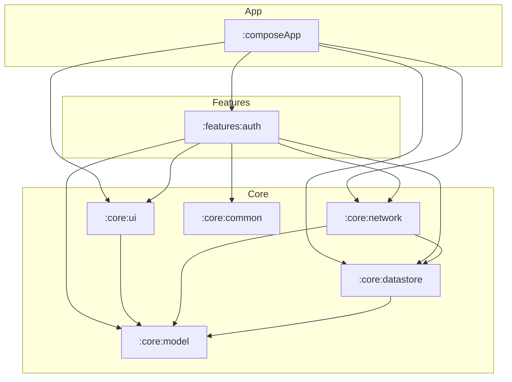

# RetailHub

## 1. Project Overview
RetailHub is a modern **Kotlin Multiplatform (KMP)** project designed for Android and iOS. Its main purpose is to demonstrate a highly scalable, modular architecture for retail applications, providing a shared business logic layer and a unified UI built with **Compose Multiplatform**. The project currently focuses on robust authentication, secure token management, and form validation as its core foundation.

---

## 2. Architecture
The project follows a **Modular, Feature-Based Architecture** with a strong emphasis on the **Separation of Concerns** and **SOLID** principles.

### Overall Approach
- **Modularization**: The codebase is split into physical Gradle modules based on functionality (features) and shared infrastructure (core).
- **MVI (Model-View-Intent)**: The presentation layer uses the MVI pattern to ensure a **Unidirectional Data Flow (UDF)**. ViewModels consume `Intents` from the UI and emit a single `UiState`.
- **Layered Features**: Each feature module (e.g., `:features:auth`) contains its own `data`, `domain`, and `presentation` layers, ensuring that business logic is isolated and highly testable.

### Dependency Flow
The dependencies flow from implementation details towards the core business logic:
- `composeApp` (App Entry) → `features` → `core:ui`, `core:network` & `core:datastore` → `core:model`.
- **Domain Independence**: Business logic in the `domain` package of each feature does not depend on external libraries like Ktor, DataStore, or Compose.

### Mermaid Diagram


---

## 3. Module Structure

| Module | Responsibility | Depends on |
| :--- | :--- | :--- |
| `:composeApp` | Main entry point for Android and iOS. Orchestrates Koin initialization and global navigation. | `:features:auth`, `:core:network`, `:core:datastore`, `:core:ui` |
| `:features:auth` | Authentication feature logic, including Login screens, validation, and user management. | `:core:ui`, `:core:network`, `:core:datastore`, `:core:model`, `:core:common` |
| `:core:ui` | Design system, common Compose components, and the shared Form Engine. | `:core:model` |
| `:core:datastore` | Persistent storage for user preferences and authentication tokens using Jetpack DataStore KMP. | `:core:model` |
| `:core:network` | Shared Ktor client configuration, including authenticated and public client variants. | `:core:model`, `:core:datastore` |
| `:core:model` | Pure Kotlin library containing shared data types like `NetworkResult` and `AuthTokens`. | None |
| `:core:common` | Low-level utilities such as Coroutine Dispatcher providers. | None |

---

## 4. Technology Stack

| Technology | Purpose |
| :--- | :--- |
| **Kotlin Multiplatform** | Sharing business logic and networking between Android and iOS. |
| **Compose Multiplatform** | Building a unified UI for both platforms using a single Kotlin codebase. |
| **DataStore KMP** | Type-safe, asynchronous persistent storage for both Android and iOS. |
| **Koin** | A pragmatic lightweight dependency injection framework. |
| **Ktor** | Asynchronous HTTP client for multiplatform networking. |
| **Kotlin Serialization** | Type-safe JSON parsing for API requests and responses. |
| **Kotlin Coroutines** | Managing background tasks and asynchronous flows. |
| **Mokkery** | A Kotlin Multiplatform mocking library for testing. |
| **JaCoCo** | Library for measuring and reporting code coverage. |
| **Material 3** | Google's latest design system for consistent and modern UI. |

---

## 5. Dependency Injection
RetailHub uses **Koin** for dependency injection.

- **Initialization**: Koin is started via `initKoin(appDeclaration)` in the `:composeApp` module.
    - **Android**: Triggered in `RetailHubApplication.kt`, passing the `androidContext`.
    - **iOS**: Triggered in `iOSApp.swift` via the `KoinKt.initKoin` wrapper.
- **Platform Modules**: Uses the `expect val platformDataStoreModule` pattern to provide platform-specific implementations (e.g., `DataStore` which requires `Context` on Android).
- **Qualifiers**: HttpClients are distinguished using names (`named(NetworkClientType.PUBLIC)` and `named(NetworkClientType.AUTHENTICATED)`).

```kotlin
// Example of platform-aware initialization
fun initKoin(appDeclaration: KoinAppDeclaration = {}) {
    startKoin {
        appDeclaration()
        modules(appModules)
    }
}
```

---

## 6. Networking
Networking is centralized in the `:core:network` module using **Ktor**.

- **Two-Client Strategy**: 
    - **Public Client**: Used for unauthenticated requests like Login or Token Refresh.
    - **Authenticated Client**: Automatically attaches Bearer tokens and handles 401 errors via a refresh mechanism.
- **Auth Plugin**: Integrates with `:core:datastore` to load tokens from disk and refresh them when expired without user intervention.
- **Safe Requests**: A `safeRequest` extension function wraps network calls to catch exceptions and map them to a sealed `NetworkResult`.
- **Data Sources**: Features use a `RemoteDataSource` interface to separate network implementation from repository logic.

---

## 7. UI
The UI is built entirely in **Compose Multiplatform** within the `:core:ui` and feature modules.

- **Form Engine**: A custom, reactive form system allows defining fields (`TextFormField`), validators (`Required`, `Email`), and state (`FormState`) in the ViewModel while rendering them automatically in the UI.
- **MVI Pattern**: The `LoginViewModel` maintains a `LoginUiState` exposed as a `StateFlow`.
- **Derived State**: Advanced optimizations using `derivedStateOf` are used in the UI to minimize recompositions for computed properties like `isEnabled`.
- **Resources**: Strings and colors are managed via Compose Multiplatform Resources for easy localization.

---

## 8. Testing Strategy
The project follows a comprehensive testing approach located in `commonTest`:

- **Mokkery**: Used to mock interfaces like `AuthenticationRepository` or `LoginUseCase`.
- **Ktor MockEngine**: Used in `AuthRemoteDataSourceImplTest` to simulate server responses.
- **DataStore Testing**: `TokenManagerImplTest` uses a real DataStore instance with temporary files to ensure reliable persistence testing across platforms.
- **ViewModel Tests**: Verify state transitions and side effects by sending `Intents`.
- **Dispatcher Injection**: A `DispatcherProvider` is used to swap `Main` and `IO` dispatchers for `StandardTestDispatcher` during tests.
- **Code Coverage**: JaCoCo is used to track test coverage.

---

## 9. Code Coverage
The project uses a custom JaCoCo plugin located in the `:jacoco` convention build logic.

### Running Coverage Reports
- **Total Project Coverage**: Generates a unified HTML/XML report for all modules.
  ```bash
  ./gradlew jacocoCoverageAggregate
  ```
  The report can be found at: `build/reports/jacoco/aggregate/html/index.html`

- **Module Specific Coverage**:
  ```bash
  ./gradlew :features:auth:jacocoCoverage
  ```
  The report will be at: `[module]/build/reports/jacoco/html/index.html`

### Including a New Module
To enable coverage for a new module, add the following to its `build.gradle.kts`:

1. Apply the plugin:
   ```kotlin
   plugins {
       id("retailhub-jacoco")
   }
   ```
2. Configure the test task to track:
   ```kotlin
   retailhubJacoco {
       // For host unit tests
       testTask.set("testDebugUnitTest") 
       // OR for instrumented tests
       testTask.set("connectedAndroidDeviceTest") 
       
       // Optional: Add specific exclusions
       exclusions.add("**/path/to/exclude/**")
   }
   ```

---

## 10. Build and Run

### Android
- **Build**: `./gradlew :androidApp:assembleDebug`
- **Run Tests**: `./gradlew :features:auth:testDebugUnitTest`

### iOS
- **Build/Run**: Use Xcode to open `iosApp/iosApp.xcodeproj`. The build is integrated with Gradle via the `embedAndSignAppleFrameworkForXcode` task.

### Common
- **Run All Tests**: `./gradlew test`

---

## 11. Development Guidelines
- **Adding Features**: Create a new package under `features/` following the `data/domain/presentation` structure.
- **Shared Models**: Data classes used across multiple modules must live in `:core:model`.
- **Persistence**: Any long-term data storage logic belongs in `:core:datastore`.
- **Networking**: Define all API endpoints in `:core:network:endpoint`.
- **MVI Contract**: Every new screen should define a `Contract` interface containing `State`, `Intent`, and `Effect`.
- **Dispatchers**: Always inject `DispatcherProvider` instead of hardcoding `Dispatchers.IO`.

---

## 12. Project Status
- **Authentication**: Fully implemented MVI-based login flow with server-side error mapping and form validation.
- **Token Management**: Secure-ready storage with automatic Ktor token refresh integration.
- **Infrastructure**: Robust multi-module Gradle setup with centralized networking and UI design system.

---

## 13. Future Improvements
- [ ] Implement actual navigation using a Multiplatform Navigation library.
- [ ] Add persistence layer using SQLDelight for complex local data.
- [ ] Implement secure storage (Keychain/EncryptedSharedPrefs) within `:core:datastore`.
- [ ] Expand the Design System with more common components (Buttons, Loaders).
