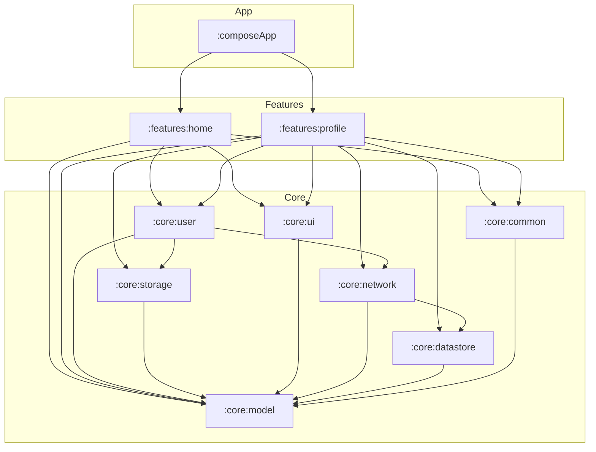

# RetailHub

## 1. Project Overview
RetailHub is a modern **Kotlin Multiplatform (KMP)** project designed for Android and iOS that uses dummy.json API with the goal to demonstrate a highly scalable, modular architecture for retail applications, providing a shared business logic layer and a unified UI built with **Compose Multiplatform**.

---

## 2. Architecture
The project follows a **Modular, Feature-Based Architecture** with a strong emphasis on **Separation of Concerns** and **SOLID** principles.

### Overall Approach
- **Modularization**: The codebase is split into physical Gradle modules based on capabilities (`features`) and shared infrastructure (`core`).
- **MVI (Model-View-Intent)**: The presentation layer uses MVI to ensure a **Unidirectional Data Flow (UDF)**. ViewModels consume `Intents` from the UI and emit a single `UiState` and one-off `Effects`.
- **Layered Features**: Each feature module (e.g., `:features:home`, `:features:profile`) contains its own `data`, `domain`, and `presentation` layers.
- **Shared Core Capabilities**: Common domain and data concepts shared across features (such as user session management) are extracted into dedicated core modules (e.g., `:core:user`, `:core:storage`, `core:ui`, `core:common`).

### Dependency Flow
The dependencies flow from implementation details towards abstractions and core logic:
- `composeApp` (App Entry & Navigation) → `features` → `core:ui`, `core:user`, `core:storage`, `core:network`, `core:datastore`, `core:common` → `core:model`.
- **Feature Independence**: Features do not depend on each other (`:features:home` and `:features:profile` interact through shared `:core` abstractions).
- **Domain Independence**: Business logic in `domain` packages does not depend on external infrastructure like Ktor, DataStore, or Compose.
- **Controller-Delegate Pattern**: Used for platform capabilities (Permissions, Camera, Gallery, Maps) to keep ViewModels platform-agnostic.

### Mermaid Diagram

```mermaid
flowchart TD
    subgraph App
        composeApp[":composeApp"]
    end

    subgraph Features
        home[":features:home"]
        profile[":features:profile"]
    end

    subgraph Core
        ui[":core:ui"]
        user[":core:user"]
        storage[":core:storage"]
        network[":core:network"]
        datastore[":core:datastore"]
        common[":core:common"]
        model[":core:model"]
    end

    composeApp --> home
    composeApp --> profile

    home --> ui
    home --> user
    home --> common
    home --> model

    profile --> ui
    profile --> user
    profile --> storage
    profile --> network
    profile --> datastore
    profile --> common
    profile --> model

    user --> network
    user --> storage
    user --> model

    storage --> model
    ui --> model
    network --> datastore
    network --> model
    datastore --> model
    common --> model
```

---

## 3. Module Structure

| Module | Responsibility                                                                                                                 | Depends on |
| :--- |:-------------------------------------------------------------------------------------------------------------------------------| :--- |
| `:composeApp` | Orchestrates Navigation 3, global Koin DI initialization, top app bar handling, snackbar handling and platform entry points.   | `:features:auth`, `:features:home`, `:features:profile`, `:core:ui`, `:core:network`, `:core:datastore`, `:core:user`, `:core:storage` |
| `:features:home` | Displays list of products and its the entrypoint to access to all features in the app.                                         | `:core:ui`, `:core:user`, `:core:common`, `:core:model` |
| `:features:profile` | User profile information. Autheticated access is required to see this information.                                             | `:core:ui`, `:core:user`, `:core:storage`, `:core:network`, `:core:datastore`, `:core:common`, `:core:model` |
| `:core:user` | Centralized user domain and data layer managing user details, authentication fetch, and local user avatar cache.               | `:core:network`, `:core:storage`, `:core:model` |
| `:core:storage` | Platform-specific storage implementation on Android and iOS.                                                                   | `:core:model` |
| `:core:ui` | Design system, Material 3 theme, shared Compose components, Permission/Image Controller-Delegate system, and Form Engine.      | `:core:model`, `:core:datastore` |
| `:core:datastore` | Asynchronous persistent storage for user preferences and JWT tokens using Jetpack DataStore KMP.                               | `:core:model` |
| `:core:network` | Shared Ktor HTTP client configuration, public and authenticated client variants, Bearer token auto-refresh, and `safeRequest`. | `:core:model`, `:core:datastore` |
| `:core:common` | Coroutine `DispatcherProvider`, Mapbox static map URL generator, and low-level utilities.                                      | `:core:model` |
| `:core:model` | Pure Kotlin multiplatform entities shared across two or more features (`NetworkResult`, `AuthTokens`, etc.).                   | None |

---

## 4. Technology Stack

| Technology | Purpose |
| :--- | :--- |
| **Kotlin Multiplatform** | Sharing business logic, data layers, and networking across Android and iOS. |
| **Compose Multiplatform** | Building a unified UI for Android and iOS using a single Kotlin codebase. |
| **Navigation 3** | Type-safe multiplatform navigation system (`@Serializable` routes with state restoration). |
| **DataStore KMP** | Type-safe, asynchronous persistent storage for both Android and iOS. |
| **Koin** | Pragmatic lightweight dependency injection framework. |
| **Ktor** | Asynchronous HTTP client with Bearer token refresh interceptors. |
| **Coil 3** | Image loading library for Compose Multiplatform. |
| **Mapbox** | Used for static map visualization via Static Maps API. |
| **BuildKonfig** | Multiplatform BuildConfig generation for managing secrets (`MAPBOX_ACCESS_TOKEN`). |
| **Kotlin Serialization** | Type-safe JSON parsing for API requests, responses, and routes. |
| **Kotlin Coroutines & Flow** | Asynchronous task management and reactive state streams. |
| **Mokkery** | Kotlin Multiplatform mocking library for unit testing. |
| **Turbine** | Flow testing library for coroutines and MVI contracts. |
| **JaCoCo** | Code coverage measurement and reporting tool. |
| **Spotless & Detekt** | Formatting (KtLint) and static analysis tools. |
| **Material 3** | Unified design system for modern multiplatform UI. |

---

## 5. Dependency Injection
RetailHub uses **Koin** for dependency injection.

- **Initialization**: Koin is started via `initKoin(appDeclaration)` in `:composeApp`.
    - **Android**: Triggered in `RetailHubApplication.kt` with `androidContext`.
    - **iOS**: Triggered in `iOSApp.swift` via the `KoinKt.initKoin` wrapper.
- **Platform Modules**: Uses `expect val platformDataStoreModule` and `expect val platformImageStorageModule` to provide platform-specific implementations.
- **Controller-Delegate Lifecycle**: Hardware controllers (Permissions, Image Picker) are ViewModel-scoped or factory-scoped and bound to UI lifecycle on Android via `InitializePermissionsAndPicker()`.
- **Qualifiers**: HttpClients are distinguished using named qualifiers (`named(NetworkClientType.PUBLIC)` and `named(NetworkClientType.AUTHENTICATED)`).

---

## 6. Permission & Hardware Handling
The project implements a **Controller-Delegate** pattern to handle platform-specific hardware and system APIs (Camera, Gallery, Permissions) while keeping ViewModels platform-agnostic.

- **Permissions**: Managed via `PermissionController`. On Android, it uses `ActivityResultLauncher` bound via UI composable delegates. On iOS, it uses native `AVFoundation` and `Photos` APIs.
- **Image Picking**: Managed via `ImagePickerController`, allowing seamless camera capture and gallery selection across platforms.

---

## 7. Networking
Networking is centralized in `:core:network` using **Ktor**.

- **Two-Client Strategy**: 
    - **Public Client**: Used for unauthenticated requests (`/login`, `/register`, `/refresh`).
    - **Authenticated Client**: Automatically attaches Bearer tokens and handles 401 errors via automatic token refresh.
- **Safe Requests**: A `safeRequest` extension function wraps network calls to catch exceptions and map them to a sealed `NetworkResult`.

---

## 8. UI & Navigation
- **Navigation 3**: Handled in `:composeApp` via `NavDisplay`. Routes are `@Serializable` sealed interfaces extending `NavKey`. Back stack state is preserved across process death via `rememberSerializable`.
- **Form Engine**: A custom, reactive form system allows defining fields and validators in the ViewModel while rendering them automatically in the UI.
- **Resources**: Strings, drawables, and colors are managed via Compose Multiplatform Resources (`Res`).
- **Maps**: Static map images are generated using Mapbox API and rendered via Coil 3.

---

## 9. Testing Strategy
- **Mokkery**: Used to mock interfaces in `commonTest`.
- **Turbine**: Used to test `StateFlow` transitions and `Channel` effects in ViewModels.
- **Dispatcher Injection**: A `DispatcherProvider` is injected into ViewModels and repositories to swap `Main` and `IO` dispatchers for `StandardTestDispatcher` during unit tests.

---

## 10. Build and Run

### Configuration
1. Create a `secrets.properties` file in the project root.
2. Add your Mapbox access token:
   ```properties
   MAPBOX_ACCESS_TOKEN=your_mapbox_token_here
   ```

### Android
- **Build**: `./gradlew :androidApp:assembleDebug`
- **Run Unit Tests**: `./gradlew :features:auth:testAndroidHostTest`

### iOS
- **Build/Run**: Open `iosApp/iosApp.xcodeproj` in Xcode. The build integrates with Gradle via the `embedAndSignAppleFrameworkForXcode` task.

### Common Tasks
- **Format Code**: `./gradlew spotlessApply`
- **Check Formatting**: `./gradlew spotlessCheck`
- **Run Static Analysis**: `./gradlew detekt`
- **Generate Code Coverage Report - on Android**: `./gradlew jacocoCoverageAggregate`

### Login in the App - Test credential
- **Username**: emilys
- **Passowrd**: emilyspass

---

## 11. Project Status
- **Authentication**: Fully implemented MVI-based login flow with server-side error mapping and token storage.
- **Home**: Home dashboard displaying user profile avatar shortcut and navigation to profile.
- **Profile**: Complete profile viewing, avatar image picking (camera & gallery), local avatar disk caching, address details screen with Mapbox integration, logout, and account deletion.
- **Core Session & Storage**: Centralized `:core:user` and `:core:storage` modules for user session sharing and multiplatform image persistence.
